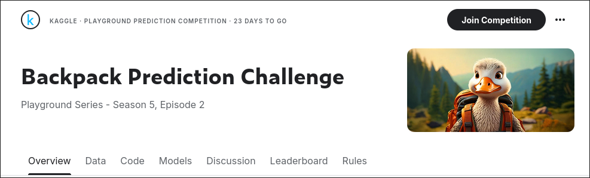

# Modelo 'Aurora': Modelo de Machine Learning de Regressão

## Introdução

  Este código tem como objetivo participar da competição "Backpack Prediction Challenge". Para obter os Dados é necessário se increver na competição.

 ## Performance

 Aurora v1.2 - MAE: 34.10 / Score Kaggle: 40.42

 ## Resumo da Versão

Este é um modelo inicial, utilizando jupyter notebook localmente, o código faz o upload dos dataset's de treino e de teste e em seguida:

1.  Realiza a separação da feature do target do dataset de treino
2.  Separa os dados Categóricos e Numéricos da feature e do dataset de teste
3.  Realiza o tratamento de variáveis categóricas, aplicando One-Hot Encoding quando não há uma relação de ordem entre os valores e Ordinal Encoding quando há uma hierarquia ou classificação entre eles
4.  Tratamento numérico, preenchendo os valores Nan com 0 (Esse parâmetro se sair melhor do que a média)
5.  Depois disso, é realizado a união da feature categórica e numérica para treinar o modelo e, a união dos dados de teste
6.  É instanciado o modelo XGBRegressor() e o mesmo é treinado com a feature (tratada) e o target separado acima
7.  Após isso é realizado a previsão com os dados de teste
8.  Por fim, é gerado um arquivo no molde da competição para upload
